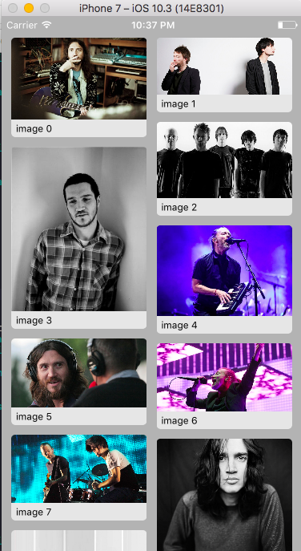
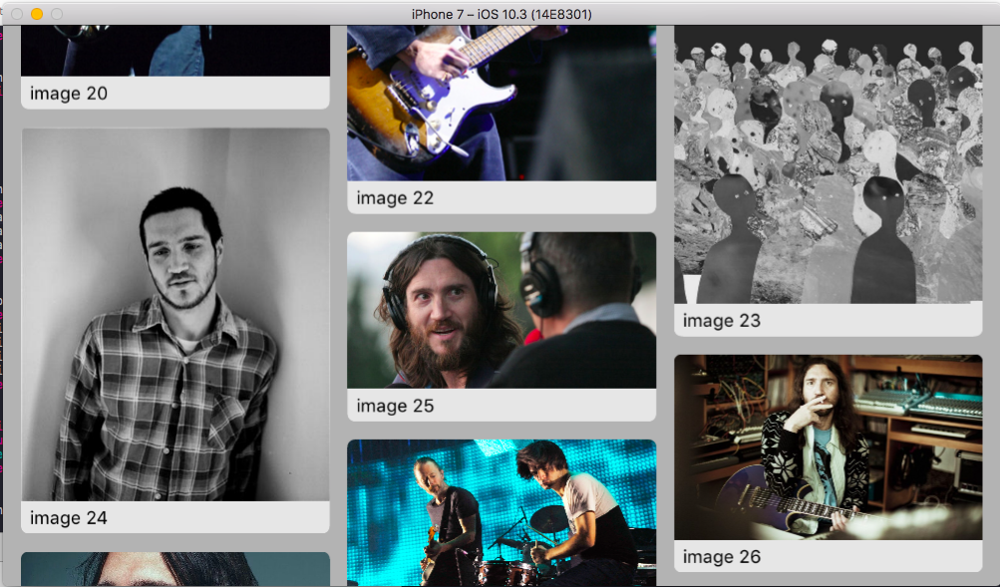

# SwiftAutoLayoutHelpers
convenient functions for iOS autolayout mechanism

examples of use:

inside a UICollectionViewCell I have these lines of code after the init()

    addSubview(containerView)
    containerView.addSubview(imageView)
    containerView.addSubview(annotation)
    
    //
    containerView.anchorTo(top: topAnchor, right: rightAnchor, bottom: bottomAnchor, left: leftAnchor, padding: PinterestCell.cellInset)
    //
    imageView.anchorTo(top: containerView.topAnchor, right: containerView.rightAnchor, left: containerView.leftAnchor)
    //
    annotationHeightConstraint = annotation.anchorTo(top: imageView.bottomAnchor, right: containerView.rightAnchor, bottom: containerView.bottomAnchor, left: containerView.leftAnchor, heightConstant: 22, rightPadding: PinterestCell.cellInset, leftPadding: PinterestCell.cellInset).last

which result in this beautiful layout:

......

for the other methods. taken from a project of mine:

    // X anchors
    firstName.centerHorizontallyTo(scrollView)
    genderTitle.alignLeftTo(email, padding: 0)
    // vertical
    NSLayoutConstraint.constraints(withVisualFormat: "V:|-30-[v0]-15-[v1]-15-[v2]-15-[v3]-15-[v4]-5-[v5]-20-[v6]-15-[v7]-25-[v8]-15-[v9]-25-[v10]-20-[v11]-15-[v12]-15-[v13]-40-|", views: firstName, lastName, dob, email, password, passwordHint, genderTitle, genderPicker, relationshipStatusTitle, relationshipPicker, termsAgreement, spamAgreement, loadingAnimation, createAccount)
    // attributes
    NSLayoutConstraint.alignAttribute(.centerX, ofViews: firstName, lastName, dob, email, genderPicker, termsAgreement, loadingAnimation, password) // should be also 'createAccount' but it has its own in didMoveToSuperview
    NSLayoutConstraint.alignAttribute(.leading, ofViews: passwordHint, genderTitle, relationshipStatusTitle, relationshipPicker)
    NSLayoutConstraint.alignAttribute(.leading, ofViews: termsAgreement, spamAgreement)
